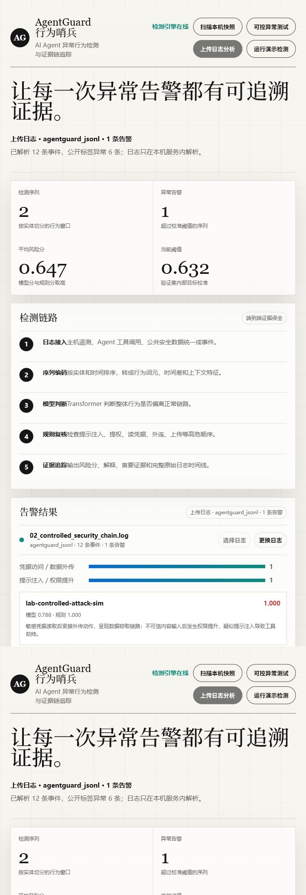

# AgentGuard 最终项目文档与部署说明

## 1. 项目一句话说明

AgentGuard 是一个 AI Agent 行为异常检测系统。它不执行攻击，也不是杀毒软件；它做的是把 AI Agent 的输入、工具调用、权限变化，与主机进程、文件、网络、注册表等日志放到同一条时间线上，判断这一串行为是否形成异常链路，并把关键证据展示给评委或安全人员复核。

通俗说，传统规则像看单张照片，AgentGuard 看的是一段录像。一次读文件、一次联网、一次创建进程单独看可能都正常，但如果顺序变成“不可信内容进入 Agent -> 权限提升 -> 读取敏感对象 -> 外连 -> 上传”，系统就会给出告警，并展示每一步发生了什么。

## 2. 当前最终确认能力

- 支持 Windows 10/11 与 macOS 本地部署。
- 支持固定种子工程基准的一键生成、训练、评估和打包。
- 支持本地 Web 演示台，默认地址为 `http://127.0.0.1:8080`。
- 支持“扫描本机快照”“可控异常测试”“上传日志分析”“运行演示检测”四种演示入口。
- 支持上传 `.log`、`.jsonl`、`.txt` 日志文件，并自动识别 AgentGuard JSONL、Loghub BGL、Loghub HDFS。
- 支持上传后更换日志，页面会显示文件名、解析器、事件数、告警数和失败原因。
- 支持点击“查看链路”展开完整时间线。
- 随包提供四个可上传 `.log` 示例，方便现场证明不是写死页面。



## 3. 四个可上传 .log 示例

文件夹：

```text
data/upload_logs/
```

| 文件 | 用途 | 预期结果 |
|---|---|---|
| `01_public_bgl_anomaly.log` | 公开 Loghub BGL 原始系统日志 | 自动识别 `loghub_bgl`，约 6 个告警 |
| `02_controlled_security_chain.log` | 可控异常行为链 | 自动识别 `agentguard_jsonl`，约 1 个告警 |
| `03_local_normal_snapshot.log` | 本机正常行为快照 | 自动识别 `agentguard_jsonl`，通常 0 个告警 |
| `04_demo_mixed_dataset.log` | 自建混合测试日志 | 自动识别 `agentguard_jsonl`，多个告警 |

推荐演示顺序：

1. 上传 `03_local_normal_snapshot.log`，说明正常日志不会被强行判异常。
2. 上传 `02_controlled_security_chain.log`，点击“查看链路”，展示异常证据。
3. 上传 `01_public_bgl_anomaly.log`，说明系统可以接入公开真实系统日志。
4. 上传 `04_demo_mixed_dataset.log`，说明系统可以批量处理多实体、多场景。

## 4. Windows 部署方法

在 PowerShell 中进入项目根目录：

```powershell
cd "C:\Users\ZhuanZ.DESKTOP-PH97BKO\Documents\New project\_github_agentguard_pr_20260722"
```

首次安装依赖：

```powershell
powershell -NoProfile -ExecutionPolicy Bypass -File .\setup_env.ps1
```

完整复现训练、评估、测试和材料生成：

```powershell
powershell -NoProfile -ExecutionPolicy Bypass -File .\run_all.ps1
```

只启动演示台：

```powershell
powershell -NoProfile -ExecutionPolicy Bypass -File .\run_demo.ps1
```

浏览器访问：

```text
http://127.0.0.1:8080
```

如果 8080 被占用：

```powershell
.\.venv\Scripts\python.exe scripts\serve.py --host 127.0.0.1 --port 8081
```

## 5. macOS 部署方法

进入项目目录：

```bash
cd "解压后的/AgentGuard"
```

首次安装依赖：

```bash
./setup_env.sh
```

完整复现：

```bash
./run_all.sh
```

只启动演示台：

```bash
./run_demo.sh
```

浏览器访问：

```text
http://127.0.0.1:8080
```

如果端口占用：

```bash
.venv/bin/python scripts/serve.py --host 127.0.0.1 --port 8081
```

## 6. 输入与输出

统一事件最低包含：

```json
{"timestamp":"2026-07-22T10:00:00Z","entity_id":"agent-01","source":"agent","event_type":"tool","action":"read","object_type":"file","object_name":"report.md","result":"success"}
```

页面上传接口的输入形式：

```json
{"filename":"01_public_bgl_anomaly.log","content":"日志文本","limit":800}
```

页面输出包含：

- `parser`：实际解析器，例如 `loghub_bgl` 或 `agentguard_jsonl`。
- `event_count`：解析出的事件数。
- `sequence_count`：形成的行为窗口数。
- `agentguard_alert_count`：AgentGuard 判出的告警数。
- `public_label_event_count`：公共日志原标签中的异常事件数。
- `results`：告警列表，包含混合分、模型分、规则分、解释、证据和时间线。

## 7. 最终检测链路

1. 日志上传或采集。
2. 自动识别格式并转换成统一 `BehaviorEvent`。
3. 按实体和时间排序。
4. 切成长度 24、步长 8 的行为窗口。
5. Tiny Transformer 输出模型异常分。
6. 透明顺序规则输出规则分。
7. 取 `max(模型分, 规则分)` 作为混合分。
8. 超过阈值则生成告警。
9. 页面展示解释、证据和完整行为链。

## 8. 当前指标口径

当前测试结果来自固定种子自建增强工程基准，不代表真实生产部署。

| 方法 | 检出率 | 误报率 | F1 | ROC-AUC |
|---|---:|---:|---:|---:|
| 异常专属词元查表 | 0.00% | 0.00% | 0.000 | 0.500 |
| Transformer 单模型 | 65.00% | 15.33% | 0.616 | 0.834 |
| 透明顺序规则 | 84.00% | 0.00% | 0.913 | 0.920 |
| 实际混合告警链路 | 97.00% | 15.33% | 0.798 | 0.971 |

答辩时要明确：97% 是混合系统结果，不是 Transformer 单模型成绩。

## 9. 真实部署边界

当前参赛版本默认只监听本机 `127.0.0.1`，适合比赛演示和离线验证。真实部署前需要补充：

- 用户认证和访问控制；
- TLS 或内网安全通道；
- 日志脱敏和敏感字段过滤；
- 上传大小、频率和实体数量限流；
- 模型版本、配置哈希和阈值审计；
- 按业务角色分别校准阈值；
- 人工复核反馈与漂移监测；
- 与 Langfuse、Phoenix、OpenLLMetry、osquery、Wazuh、Falco 等采集系统对接。

## 10. 答辩推荐说法

可以说：

“这个系统不是只看一条日志，而是看一串行为。我们把 Agent 和主机日志统一成时间线，用模型发现上下文偏离，用规则确认明确高危顺序，最后把每次告警的关键事件和原始日志展示出来。当前 97% 是自建工程基准上的混合系统结果，不代表生产环境；但项目已经支持本机正常日志、可控异常日志和公开 BGL 系统日志上传演示。”

不要说：

“模型已经能识别所有未知攻击”“这就是生产级安全产品”“公开日志证明 AI Agent 检测真实准确率是 97%”。
